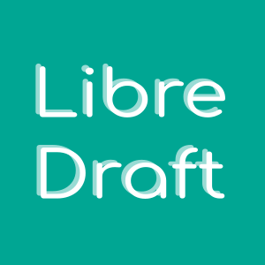

<a name="readme-top"></a>

<!-- PROJECT SHIELDS -->

[![Contributors][contributors-shield]][contributors-url]
[![Forks][forks-shield]][forks-url]
[![Stargazers][stars-shield]][stars-url]
[![Issues][issues-shield]][issues-url]
[![MIT License][license-shield]][license-url]

<!-- PROJECT LOGO -->
<br />
<div align="center">
  <a href="https://github.com/libredraft/libredraft">
    
  </a>

  <h1 align="center">LibreDraft</h1>

  <p align="center">
    Free, open-source, and lightweight! Design 2D CAD projects in your browser.
    <br />
    <a href="https://github.com/libredraft/libredraft"><strong>Explore the docs »</strong></a>
    <br />
    <br />
    <a href="https://libredraft.github.io/libredraft">View Live Version</a>
    ·
    <a href="https://github.com/libredraft/libredraft/issues/new?labels=bug&template=bug-report---.md">Report Bug</a>
    ·
    <a href="https://github.com/libredraft/libredraft/issues/new?labels=enhancement&template=feature-request---.md">Request Feature</a>
  </p>
</div>

<!-- TABLE OF CONTENTS -->
<details>
  <summary>Table of Contents</summary>
  <ol>
    <li>
      <a href="#about-the-project">About The Project</a>
    </li>
    <li>
      <a href="#getting-started">Getting Started</a>
    </li>
    <li><a href="#roadmap">Roadmap</a></li>
    <li><a href="#contributing">Contributing</a></li>
    <li><a href="#license">License</a></li>
    <li><a href="#contact">Contact</a></li>
  </ol>
</details>

<!-- ABOUT THE PROJECT -->

## About The Project

**Unleash your creativity anywhere!** This is a free and open-source 2D computer-aided design (CAD) application that runs entirely in your web browser. No downloads, no installations – just design!

### Features

- **Create with Ease:** Draw lines, shapes (rectangles, circles, etc.), arcs, and add text annotations – all with a user-friendly interface.
- **Precise Control:** Resize, move, and delete elements with ease. Customize designs further by adjusting stroke color, width, fill color, and opacity.
- **Effortless Alignment:** Utilize snapping features and dynamic guides for perfect placement and control over your designs.
- **Seamless Workflow:** Import existing SVG designs for further editing and seamlessly export your creations for sharing or using in other applications.

<!-- GETTING STARTED -->

## Getting Started

### Option 1: Try the Live Version

You can start by trying the [live version](https://libredraft.github.io/libredraft) of the app. This is the easiest option and doesn't require any setup.

### Option 2: Run a Local Version

For those interested in contributing to the project, you can clone and run a local copy of the application. Here are the steps involved:

#### Prerequisites

Ensure you have Node.js and Git installed on your system. You can find download instructions on their official websites (https://nodejs.org/en & https://git-scm.com/downloads).

#### Installation

1. **Clone the Repository:** Open your terminal and run the following command to download the project's code:
   ```sh
   git clone https://github.com/libredraft/libredraft.git
   ```
2. **Install Dependencies:** Navigate to the project directory and then run:
   ```sh
   npm install
   ```
   This will install all the necessary libraries the application needs to run.
3. **Start the Development Server:** Finally, to launch the local development environment, run:
   ```sh
   npm start
   ```
4. **Open the App:** Visit http://localhost:3000 in your web browser to access the running instance of LibreDraft.

<!-- ROADMAP -->

## Roadmap

- [x] Implement core drawing and editing tools.
- [ ] Implement advanced drawing and editing tools.
- [ ] Create and manage layers and groups.
- [ ] Allow users to collaborate on drawings or work on drawings together.

See the [open issues](https://github.com/libredraft/libredraft/issues) for a full list of proposed features (and known issues).

<!-- CONTRIBUTING -->

## Contributing

**Your contributions make a real difference!** They fuel the open source community's spirit of learning, inspiration, and creation.

Here's how you can get involved:

**Got an idea?** Share it! Fork the repo and create a pull request for your changes.

**See something that needs fixing?** Open an issue with the "enhancement" tag.

**Love the project?** Give the project a star on GitHub to show your support!

Thanks for being part of the community!

Ready to dive deeper? Here's a quick guide to contributing code:

1. Fork the Project
2. Create your Feature Branch (`git checkout -b feature/AmazingFeature`)
3. Commit your Changes (`git commit -m 'Add some AmazingFeature'`)
4. Push to the Branch (`git push origin feature/AmazingFeature`)
5. Open a Pull Request

<!-- LICENSE -->

## License

Distributed under the MIT License. See `LICENSE.txt` for more information.

<!-- CONTACT -->

## Contact & Social Networks

For any inquiries, feel free to reach out via email or connect with us on social media:

Email: libredraft@gmail.com

X: [@libredraft](https://x.com/libredraft)

<p align="right">(<a href="#readme-top">back to top</a>)</p>

<!-- MARKDOWN LINKS & IMAGES -->
<!-- https://www.markdownguide.org/basic-syntax/#reference-style-links -->

[contributors-shield]: https://img.shields.io/github/contributors/libredraft/libredraft.svg?style=for-the-badge
[contributors-url]: https://github.com/libredraft/libredraft/graphs/contributors
[forks-shield]: https://img.shields.io/github/forks/libredraft/libredraft.svg?style=for-the-badge
[forks-url]: https://github.com/libredraft/libredraft/network/members
[stars-shield]: https://img.shields.io/github/stars/libredraft/libredraft.svg?style=for-the-badge
[stars-url]: https://github.com/libredraft/libredraft/stargazers
[issues-shield]: https://img.shields.io/github/issues/libredraft/libredraft.svg?style=for-the-badge
[issues-url]: https://github.com/libredraft/libredraft/issues
[license-shield]: https://img.shields.io/github/license/libredraft/libredraft.svg?style=for-the-badge
[license-url]: https://github.com/libredraft/libredraft/blob/master/LICENSE.txt
[linkedin-shield]: https://img.shields.io/badge/-LinkedIn-black.svg?style=for-the-badge&logo=linkedin&colorB=555
[linkedin-url]: https://linkedin.com/in/libredraft
[product-screenshot]: images/screenshot.png
[Next.js]: https://img.shields.io/badge/next.js-000000?style=for-the-badge&logo=nextdotjs&logoColor=white
[Next-url]: https://nextjs.org/
[React.js]: https://img.shields.io/badge/React-20232A?style=for-the-badge&logo=react&logoColor=61DAFB
[React-url]: https://reactjs.org/
[Vue.js]: https://img.shields.io/badge/Vue.js-35495E?style=for-the-badge&logo=vuedotjs&logoColor=4FC08D
[Vue-url]: https://vuejs.org/
[Angular.io]: https://img.shields.io/badge/Angular-DD0031?style=for-the-badge&logo=angular&logoColor=white
[Angular-url]: https://angular.io/
[Svelte.dev]: https://img.shields.io/badge/Svelte-4A4A55?style=for-the-badge&logo=svelte&logoColor=FF3E00
[Svelte-url]: https://svelte.dev/
[Laravel.com]: https://img.shields.io/badge/Laravel-FF2D20?style=for-the-badge&logo=laravel&logoColor=white
[Laravel-url]: https://laravel.com
[Bootstrap.com]: https://img.shields.io/badge/Bootstrap-563D7C?style=for-the-badge&logo=bootstrap&logoColor=white
[Bootstrap-url]: https://getbootstrap.com
[JQuery.com]: https://img.shields.io/badge/jQuery-0769AD?style=for-the-badge&logo=jquery&logoColor=white
[JQuery-url]: https://jquery.com
[twitter-shield]: https://img.shields.io/badge/-Twitter-black.svg?style=for-the-badge&logo=twitter&colorB=555
[twitter-url]: https://twitter.com/libredraft
